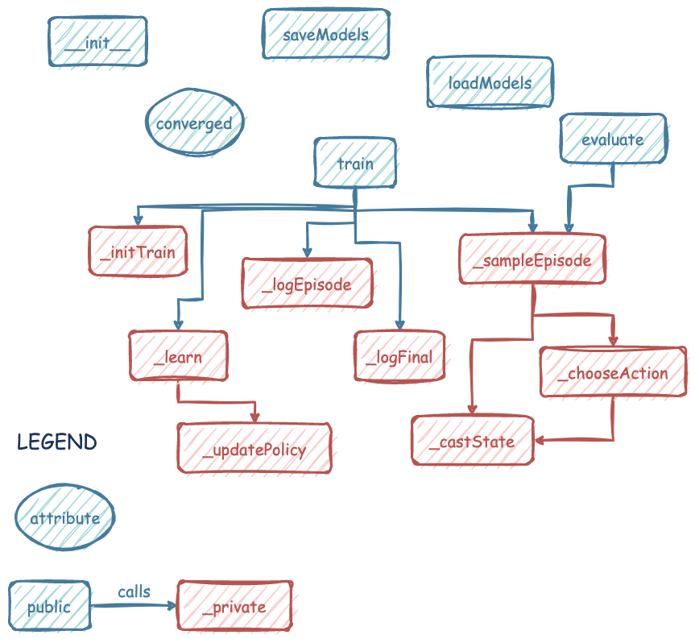

# PBRL Agents

## Module structure

This module contains the implementations of our two policy-based agents.
`REINFORCE` (also known in the literature as 'vanilla policy gradient') is implemented in _reinforce.py_, and `ActorCritic` is implemented in _actorcritic.py_.

Both agents are implemented as subclasses of the abstract `PBAgent` class, which is defined in _base.py_.
All agents share the same API, and have identical function signatures for their methods.
Below is a diagram of the agent class, where all of the methods are listed with the methods they themselves call.

